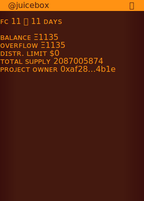

# Juicebox Token Resolver

Creates onchain SVG Metadata for all v2 Juicebox projects.

## Getting started

This repo relies on Mainnet forking for its tests. This approach allows tests to surface real chain data, and avoids the need to redeploy the entire Juicebox protocol, Juicebox Project Handles, and ENS protocol, as well as instantiating projects, .eth addresses, and handles, before running its own test. The tradeoff is that you need access to an RPC to test the repo.

⚠️ Security note ⚠️ This repo's tests use forge's `ffi` to save SVG images to disk and open them in your default SVG reader (usually the browser). This rendering approach means that malicious updates to this repo, or forks thereof, could allow Node to execute code on your system with filesystem access, and open files in your browser or other applications. Please be careful to check that no malicious changes have been introduced to the code before running tests. This code is provided as-is with no guarantee or warranty. 

### Installation

1. `git clone` this repo.
2. Install [Foundry](https://book.getfoundry.sh/getting-started/installation.html), or update Foundry with `foundryup`.
3. `cd` into the directory and call `forge install && yarn install` to install dependencies.
4. You will need an ETH RPC API key to fork mainnet in tests. You can acquire a free API key from Infura, Alchemy, and other providers listed on https://ethereumnodes.com/.

## Testing

### Run all tests

Run `forge test --fork-url $ETH_RPC_URL -v --via-ir --ffi`, replacing `$ETH_RPC_URL` with your own RPC provider and API key. An RPC url might look like `https://mainnet.infura.io/v3/xyzabc123xyzabc123xyzabc123`.

If you append `--fork-block-number BLOCK_NUMBER` to the above, replacing `BLOCK_NUMBER` with a recent block height, Forge will cache the fork and the tests will run faster. Do not be surprised if values don't change when you set a new project handle onchain.

### Test *only* the default SVG output

This test generates the default SVG to `src/onchain.svg`.

Run `forge test --fork-url $ETH_RPC_URL -v --via-ir --ffi --match-test Get`

## Deploying

Note: Update `foundry.toml`'s `solc` reference as needed.

### Goerli
#### DefaultTokenUriResolver
`forge create --rpc-url $GOERLI_RPC_URL --constructor-args-path constructor-args/DefaultTokenUriResolver/goerli_constructor_args --private-key $GOERLI_PRIV_KEY --etherscan-api-key $ETHERSCAN_API_KEY --via-ir --verify src/DefaultTokenUriResolver.sol:DefaultTokenUriResolver`

#### TokenUriResolver (untested)
Update the third address in `/constructor-args/tokenUriResolver/goerli_constructor_args` to the DefaultTokenUriResolver deployed in the previous step.

`forge create --rpc-url $GOERLI_RPC_URL --constructor-args-path constructor-args/TokenUriResolver/goerli_constructor_args --private-key $GOERLI_PRIV_KEY --etherscan-api-key $ETHERSCAN_API_KEY --via-ir --verify src/TokenUriResolver.sol:TokenUriResolver`

## Example output

## Additional resources 
- Useful byte length checker https://mothereff.in/byte-counter

## Credits
This project would not have been possible without the following contributions. Thank you! 
- [Capsules](https://cpsls.app/) is an onchain typeface by [Peripheralist](https://github.com/peripheralist/typeface).
- The `ffi` script and `open.js` was developed by [Jeton Connu](https://github.com/jeton-connu).
- [Dr.Gorilla](https://github.com/drgorillamd) provided devops support during the development of this project.
- [Jango](https://github.com/mejango) and the Juicebox Contract Crew created the Juicebox protocol.